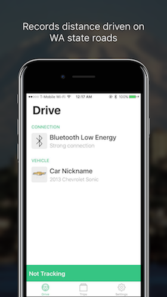
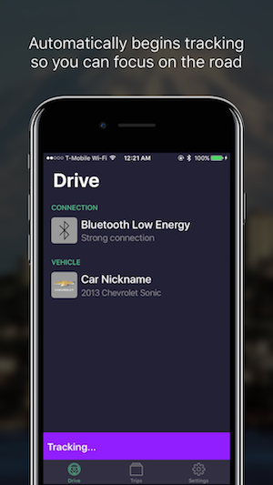
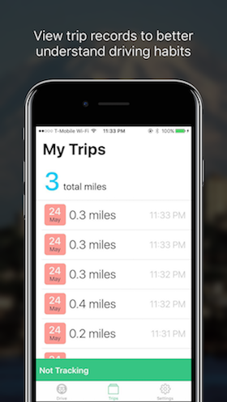

# WARUC: Washington Road Usage Charge Pilot

The Washington Road Usage Charge Pilot Program is the future of supporting your state's transportation infrastructure. Vehicles and trips are accessible on all your devices. It's easy to pair and get back to driving with our application.

## About the Project
The project was developed as part of the [University of Washington Information School](https://ischool.uw.edu) Capstone 2017 event. The application was developed in conjunction with the [Challenge Seattle](http://www.challengeseattle.com/) initiative and the [WA Road Usage Charge Pilot Project](https://waroadusagecharge.org/).

## Features
- Easy pairing and quick recognition of vehicles.
- Trip records to better understand your driving habits.
- Automatic mileage recording so you aren't distracted while driving.
- Completely secure and encrypted to ensure your privacy.

## Requirements
The app requires a Bluetooth OBD-II device to connect to our application. Please purchase one to utilize the application.

## Contact
Visit https://waruc.github.io for more information.
Email us at [caspstone.waruc (at) gmail.com](mailto:capstone.waruc@gmail.com)

### Team
- [Dylan Babbs](mailto:dbabbs@uw.edu) (Informatics '17)
- [Jackson Brown](mailto:jmaxfieldbrown@gmail.com) (Informatics '17)
- [Jack Fox](mailto:foxtjack@gmail.com) (Informatics '17)
- [Nick Nordale](mailto:nicknordale@gmail.com) (Informatics '17)
- [Ishan Saksena](mailto:ishansaksena@gmail.com) (Informatics '18)

## Other
Terms of Service: https://waruc.github.io/terms-of-service.html
Privacy Policy: https://waruc.github.io/privacy-policy.html
